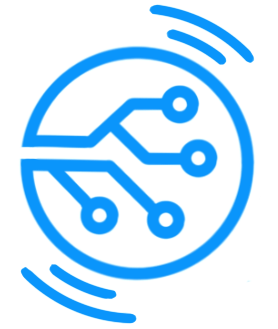

<p align="center">
  
</p>

<h1 align="center">POLAR lite</h1>

<p align="center">
  A local-first AI chat app built for working with different models, keeping conversations organized, and offering a simple, lightweight, pleasant experience.
</p>
<br>

## AI That Feels Close, Fast, and Yours

POLAR lite is a chat experience inspired by the comfort of modern conversational tools, but designed to give you more control. The app is meant to run in your own environment, keep your conversations organized, and let you choose how you want to work with AI at any moment.

This is not just about sending prompts back and forth. POLAR lite aims to be a space where you can think, write, explore ideas, and keep context without friction.

## What You Can Do With POLAR lite

- Chat with different models from a single interface, without switching tools.
- Choose between local and remote providers depending on what each conversation needs.
- Run local models with MLX on Apple Silicon.
- Connect to Ollama and use your local model library.
- Use OpenAI whenever you want access to cloud models.
- Create projects to separate topics, clients, ideas, or workstreams.
- Save conversations and return to them later without losing context.
- Define profiles with different instructions, tone, and generation settings.
- Adjust system prompts and preferences so the assistant fits your workflow.

## Designed To Feel Natural

The experience is designed to feel clear from the first moment: a sidebar for navigating projects and conversations, a clean central chat area, and simple controls for switching models, providers, and settings.

The goal is for it to feel light, direct, and friendly. Less friction, more continuity.

## Great For

- People who want a more private and controllable AI app.
- Anyone who prefers local models whenever possible.
- Teams or creators who need to organize conversations by project.
- Users who often switch between response styles, contexts, and models.

## Supported Providers

POLAR lite can work with multiple AI paths inside the same app:

- `MLX`: for local inference on Apple Silicon.
- `Ollama`: for connecting to models served on `localhost`.
- `OpenAI`: for using remote models with your own API key.

## Quick Start

If your environment is already set up, you can start the app like this:

```bash
source .venv/bin/activate
python app/web_server/main.py
```

Then open the interface in your browser and start creating projects, profiles, and conversations.

## In One Line

POLAR lite is a local-first, flexible, pleasant AI conversation space built to help you choose your models, organize your work, and keep the experience simple from beginning to end.
